# Table of Contents

- [Table of Contents](#table-of-contents)
- [Internet Computer Architecture](#internet-computer-architecture)
  - [ICP, Data Centers and Nodes](#icp-data-centers-and-nodes)
  - [Software Canisters](#software-canisters)
  - [Subnets](#subnets)
  - [Subnet Types](#subnet-types)
  - [System and Bucket Subnets](#system-and-bucket-subnets)
  - [Privacy-Hardened Subnets](#privacy-hardened-subnets)
  - [Subnet Management](#subnet-management)
- [BigMap](#bigmap)
  - [Communicate through the BigMap Index](#communicate-through-the-bigmap-index)
  - [Communicate directly with the Data Bucket canisters](#communicate-directly-with-the-data-bucket-canisters)
- [Current status](#current-status)
  - [Scalability](#scalability)
  - [BigSearch](#bigsearch)
- [Future work](#future-work)
  - [Forking](#forking)
  - [Upgrading](#upgrading)

# Internet Computer Architecture
## ICP, Data Centers and Nodes

The Internet Computer is a public compute platform, which is formed by an open protocol called ICP (Internet Computer Protocol). The protocol is used by independent data centers around the world to combine compute power and create a seamless universe for internet-native software that is tamperproof and unstoppable, and which supports new forms of software, such as autonomous software, that can be used to create a new form of “open” internet service. In a similar way that the Internet is a public utility, which is owned by mankind, even though it weaves together privately owned and operated networks, so too is the Internet Computer, even though it combines compute capacity provided by privately owned and operated data centers. Users, developers, and data centers, all interact with the protocol, which orchestrates all things. Data centers supply compute capacity to the protocol, which becomes their customer. Within the protocol, computation and data storage must be paid for using “cycles”, which generates an economy through which data centers get paid in direct proportion to the computational capacity they are able to suply.

To participate within the Internet Computer network, a data center must first acquire a DCID, or data center identity. The network has a governance system, through which applications for DCIDs are made, in a process that elucidates information about the facilities involved, and the owners that can exert control, since the protocol needs this information to provide certain security properties. Once a data center has acquired a DCID, it is then able to make “node machines” available to the network, which once inducted, generate fixed rewards each month of operation. A node machine comes in a 1U format so data centers can pack large numbers into racks to make efficient use of real estate. The specification of a node machine’s hardware must meet a targeted standard node machine specification, since otherwise the node may fall behind with the computations involved in protocol participation, with the result that the protocol might eventually sanction the data center. The Internet Computer is designed to host compute units known as “software canisters”, which are replicated across discrete subsets of nodes, which are known as subnets.

## Software Canisters
A canister bundles software logic, described by WebAssembly byte code, with the data that it directly processes and maintains. The environment in which a canister runs is very simple. They may share selected software functions, so that Web browsers and phone apps, and other canisters on the network, can call them if they have permission, and invoke some functionality. The processing of inbound calls, and results returned by calls to other canisters, is processed in series so that within a canister there is only ever a single concurrent thread of execution (roughly speaking, they are software “actors”). Beyond that, there is not much. There is no filesystem, and persistence occurs because canisters are never reset so their data can live within the memory pages that they use to run their software, saving developers from the traditional complexity involved in marshaling data in and out of files and databases to prevent it being lost on reboot or crash (the technical term for the scheme “orthogonal persistence”). Canisters allow systems to be created from software in its purest form, where developers focus on what should be done, rather than how it is achieved, with the primary complexity relating to how data is migrated when software is updated. To execute invoked function calls, and maintain pages of memory, a canister needs to spend “cycles”. Executing a low-level WebAssembly instruction, or maintaining a 4K page of memory, consumes a known and fixed
number of cycles.

The ICP protocol maintains replicas of canisters on different nodes in the network. Since the protocol often has to redistribute canisters among nodes to rebalance load, the total quantity of data a canister can store is strictly limited to 4GB at the time of writing (1M memory pages). Function calls to canisters execute deterministically, which means that each replica will return the same result when they run them, and calls may be made in two distinct ways. If an “update call” is made, then all replicas run the call, and any changes to the canister’s memory pages or meta data (collectively, the canister’s “state”) is persisted. On the other hand, a “query call” can be run by only a single replica, and during the call, all existing data in memory is read-only, and any changes to memory that the software makes are discarded once the call is complete. Since all replicas must execute an update call, the volume of update call processing a canister can perform is bounded by the capacity of a single replica. Meanwhile, since a query call can be run on a single replica, the volume of query call processing a canister can perform can be scaled-out by adding new replicas.

## Subnets
The Internet Computer uses discrete subsets of its nodes to maintain replicas of discrete subsets of canisters, which are called “subnets”. The nodes in a subnet all share a common hardware specification, and they run secure network protocols in order to symmetrically replicate the canisters they host in a fault tolerant way, which guarantees that if some proportion of nodes fall offline, or even if they become maliciously faulty and some attacker coordinates their actions to try and subvert the protocols to disrupt canister services or corrupt their data, the hosted canisters will remain live and continue to correctly execute calls against the correct canister data. For the purposes of security and fault tolerance, a subnet requires that some number of its nodes are drawn from independent data centers (data centers that are controlled by different parties). Generally, the greater the number of independent nodes that exist within a subnet, the stronger the guarantees regarding the correct operation and liveness the protocols involved provide. The number of independent nodes in a subnet is known as the Secure Consensus Quorum (SCQ). Additional nodes can be added to a subnet to scale-out the volume of query calls it can process, and also to improve user experience by incorporating replica nodes “near” to demand for canister services, which reduces call latency. The only constant is that the total quantity of canister data the subnet can store, and the maximum volume of update call processing it can perform, are bounded by the capacity of a single replica node.

## Subnet Types
The Internet Computer network contains subnets of different “types”, which are standardized and few in number. When canisters are uploaded, they must specify the type of subnet they are targeting, and the Internet Computer guarantees they will only be hosted on that type. The type of a subnet fixes key characteristics, such as the SCQ, and the hardware specification of its nodes. Consequently, aside from the specific properties these characteristics confer, such as relative strength of weakness of security and liveness guarantees, they also determine how many cycles their hosted canisters consume when they execute instructions and maintain memory pages, which values canister software may occasionally depend upon directly. Special subnet types can utilize extra powerful nodes machines to increase the maximum volume of update call processing hosted canisters can perform, or make use of special hardware features designed to ensure privacy of canister data even from attackers that have access to the node hardware (such as enclave technology). However, even subnets that have the same type may be composed from different numbers of nodes. The Internet Computer can add nodes to a subnet to scale out the volume of query call processing hosted canisters can perform, and may also add nodes drawn specifically from data centers that are near to the demand for canister services, in terms of the inherent network latency involved serving query call requests to end users, to improve user experience. Although the subnets of the same type can contain different numbers of nodes, the standardized cycles that canisters consume when processing calls and maintaining memory remains constant since the extra nodes are paid for by the extra consumption of query call cycles.

## System and Bucket Subnets
The two most basic types of subnet are “system subnets” and “bucket subnets”, which have SCQs of 28 and 4 respectively, and type codes S28 and S4. An S28 subnet contains a minimum of 28 nodes drawn from independent data centers, which in practical terms makes it completely tamperproof and unstoppable, since at least 10 of the independent data centers involved would need to maliciously collaborate (or fail in some way that approximated this behavior) to prevent it correctly processing update calls or corrupt its data. For this reason, S28 subnets are designed to host core enterprise systems and internet services, and the developers of canisters that target them may safely assume that they cannot fail. By contrast, an S4 subnet only contains a minimum of 4 nodes drawn from independent data centers, which does not meet the same standards, since only 2 of the independent data centers would need to maliciously collaborate to prevent it correctly processing update calls or corrupt data (although in practice independent data centers have nothing to gain by collaborating to corrupt the hosted data, and the chances this happening is therefore still vanishingly small in practice). However, the inherent underlying fixed hardware cost involved in storing canisters on S4 subnets is greatly reduced, since the data and computations need only be replicated across four node machines, and for this reason they are ideal for maintaining canisters within systems that are involved in storing social media, such as photos or video, or large amounts of business data, that might be maintained for later analysis say.

System and bucket subnets also have another absolutely fundamental difference. Whereas a system subnet is “trusted” by the overall Internet Computer network, a bucket subnet is not. Essentially, it is considered beyond the realms of practical possibility that a sufficient portion of the SCQ of independent data centers involved in a system subnet would become malicious and collaborate to make them perform invalid computations or corrupt data, but this does not hold for bucket subnets. For this reason, the protocols that run the Internet Computer network always treat bucket subnets as though they have already been compromised. This means, for example, that although canisters on bucket subnets can hold balances of cycles to power their operation, they cannot transfer that cycles to other canisters. Moreover, while they can respond to incoming update and query calls, they cannot make outgoing calls to other canisters on the network. For such reasons, bucket subnets are great places to store data at low cost, and run related processing, but they are not as useful for maintaining core systems.

## Privacy-Hardened Subnets
**Note:** privacy-hardened subnets will not be available at launch, but are described here since they will become a standard part of the Internet Computer network and therefore sample apps can be designed that will use them (since no special code is needed).

A key benefit of the Internet Computer is that it hosts canisters within a tamperproof environment, so that software systems and services do not depend for their security on VPNs, firewalls, system configuration, regularly patching software, the maintenance of SEIM logs, and the honesty of insiders, among many other things. This is possible because subnets are formed by nodes in independent data centers that are coordinated by protocols that have mathematically provable security properties, which, sans bugs in the protocol implementation, can only be subverted if a third or more of the data centers become corrupted, which is extraordinarily unlikely. For this reason, hackers cannot find backdoors or exploits through which they can subvert subnets, since they cannot circumvent the laws of mathematics and achieve the equivalent of making two plus two equal five, pretty much guaranteeing canisters hosted on system subnets always run in the correct way against the correct data. However, although hosted canisters cannot be subverted and always run correctly, and will therefore always respect logic that prevents them divesting private data to unauthorized persons, the data within canisters can potentially be accessed by malicious systems administrators that are working for the data centers that host node hardware, since they have access to the actual machines that store replicated data. For example, such an administrator might disassemble a node machine to gain access to its storage hardware. For some applications, it is very important that their canister data does not get compromised, and however unlikely, the potential that a malicious data center administrator might gain access is an unacceptable risk.

The first approach to protecting canister data from malicious administrators involves using hardware “enclave” technology called SEV-ES that is built into the AMD EPYC 2 processors, which are currently used to construct standard node machines. Privacy-hardened subnet types PHSE.S28 and PHSE.S4 use this approach, whose type codes translate to “privacy hardened SEV-ES system subnet” and “privacy hardened SEV-ES bucket subnet” respectively. Nodes in these subnets run their replicas using virtual machine software that supports SEV-ES, which makes the data they are processing inaccessible, even to the host operating system, and even to those with physical access to the node hardware, because the CPU seamlessly encrypts and decrypts data as it moves to and from main memory (RAM), such that even if an attacker was able to take a snapshot of the contents of the main memory chips, he would see only random bytes. SEV-ES additionally provides replica software running within the enclave with its own unique secret encryption key (which is deterministically derived from the software image), which supports the maintenance of data on non-volatile memory, whose data survives power cycles (such as an SSD), in encrypted form. To further harden privacy, during subnet setup, the replicas run an additional protocol to establish a public key pair that is shared amongst all the nodes, which allows end user software to submit update and query calls to hosted canisters that are encrypted in such a way that any of the replica nodes can decrypt them inside the enclave. SEV-ES can be defeated, but it greatly complicates the task of a malicious administrator wishing to gain unauthorized access to the data. These subnets consume the same cycles for storage, but increase the cycles consumed per low-level instruction processed by a factor of 50%, so as always, extra security comes at a cost.

The second approach to protecting canister data from malicious administrators involves using “armored machines” as node hardware. Privacy-hardened subnet types PHAMG1.S28 and PHAMG1.S4, whose type codes stand for “privacy-hardened armored-machine generation 1 system subnet” and “privacy-hardened armored-machine generation 1 bucket subnet” respectively, use this approach. These run on standard node hardware that uses a special tamperproof cage in place of a normal 1U server casing. This cage is designed in such a way that if any attempt is made to gain access to the node hardware inside, the node’s non-volatile storage is immediately and irreversibly reset, presenting malicious data center administrators with a formidable hurdle to overcome if they wish to gain unauthorized access to the data, which arguably provides a higher bar than SEV-ES. One advantage of this approach is that any type of standard node hardware can be protected from malicious data center administrators, such that hardware can be used irrespective of whether it provides special privacy-hardening features (although, at the time of writing, EPYC 2 processors provide the best bang for the buck, while also packing the SEV-ES technology as standard). Another advantage of this approach is that replica nodes do not need to encrypt and decrypt data when writing to, and reading from, non-volatile storage, which reduces replica logic complexity as regards key management, and avoids the additional computational expense when compared with enclave-based approaches. Cages cost around the same as the node hardware however, although this can be mitigated by running uprated node hardware, so as expected, the cost of hosting canisters on subnets providing extra security must be reflected in extra cycles consumption.

## Subnet Management
The configuration of the Internet Computer network, and the architecture of its subnets, is managed by the Network Nervous System (NNS). The NNS is an open governance system that runs within the protocol and applies a delegated voting system to process submitted proposals en masse, which are either rejected, or adopted and executed. Interested parties with the necessary expertise, such as the DFINITY Foundation, submit network management proposals to dynamically adapt, evolve and optimize the network. The NNS has four primary network management objectives: (1) to ensure hosted canisters have sufficient compute and storage capacity to meet their demands, (2) to ensure subnet nodes are drawn from data centers in a ways that honor the SCQ commitments of their subnet type, (3) to ensure subnet nodes are drawn, where possible, from data centers in close proximity to end-user demand for hosted canisters, which drives user experience by minimizing the network latency involved in serving query call responses by making it possible to connect users to local replica nodes, and (4) to ensure that average utilization of node hardware across the overall network is high, which drives efficiency, since each individual node machine constitutes an individual financial investment, which, independently of its current processing load, always consumes baseline resources such as electricity, data center real estate, and data center human resource.

Over time, the Internet Computer provides capacity for newly uploaded canisters by creating new subnets, since while the capacity of a subnet to process query calls can be scaled-out by adding new nodes, its capacity to process update calls, and its capacity to store canister data, is strictly bounded. It does not matter when canisters are located on different subnets, because the Internet Computer enables them to interact seamlessly irrespective of whether they are on
the same subnet, or on different subnets. New subnets are created by submitting proposals to the NNS. Each proposal lists nodes within the network that are not currently assigned to a subnet, which can be combined to create a new subnet of the specified type, given the required SCQ, type of node hardware involved, and so on. When such proposals are accepted by the NNS, the nodes involved run a setup procedure to initialize multi-party cryptographic schemes that their subnet’s operation will depend upon. Once setup is complete, the NNS can then use the new subnet to host newly uploaded canisters. At any one time, the NNS may maintain numerous subnets with spare capacity, so that it is able to receive new canisters whatever subnet type they target, and so that it can receive new canisters into subnets composed from nodes predominantly drawn from data centers in localities that reflect the distribution of expected demand (for example, one subnet might have more nodes in North America, and another in Asia).

The process of creating subnets, and assigning newly uploaded canisters to subnets, is straightforward, but it is not sufficient to build out and manage the network. Over time, the pattern of demand for a canister’s services can change, such that it needs to perform more or less query call processing, update call processing, and might store varying amounts of data up to the per-canister limit. Additionally, at different times, a canister may pay to ensure that some minimum compute capacity is reserved for its usage, which may not be possible on its current subnet, and the locality of demand for its query call services may change, changing which replica nodes within its subnet are assigned to serve query calls submitted to the network by end user software. In all therefore, the NNS also needs to be able to move canisters between subnets, to ensure they have enough update call and storage capacity, and so that, when considering the distribution of demand, that the query call processing load is distributed across nodes within each subnet with the aim that average node hardware utilization across the entire network is driven as high as possible while still leaving room to service spikes in demand. The key mechanism by which nodes are moved between subnets, so as to drive average hardware utilization, or to ensure that replicas exist near to demand, is subnet splitting and merging.

The advantage of splitting and merging subnets is that it allows for the redistribution of canisters among nodes without any interruption in service. At a high level, when it has been decided to migrate selected canisters from their current subnet to a new subnet, the new subnet is first formed by drawing and combining nodes from data centers in the desired configuration. The nodes of the new subset, which has no work, then also join the existing subnet, and run a “resume” process that in time provides them with a complete up-to-date copy of all the hosted canisters. At that moment, the new subnet is “spawned”, and becomes active, and the desired split occurs as nodes on the two subnets delete the canisters that are no longer assigned to them, while all canisters continue to run without interruption, since at any moment they exist on one of the subnets. The distribution and redistribution of nodes through the splitting and merging process, and architecting of optimal subnets, with respect to where their nodes are drawn from, and how many they have, can be directed by humans creating network management proposals and submitting them to the NNS. However, continuously adapting network architecture in an optimal way is a non-trivial optimization problem, best driven by algorithms.

Each canister generates telemetry data, which can be downloaded and processed by software. The telemetry data is generated as a side effect of the network tracking of the “cycles” spent when canisters process calls and store data, and it includes information about the localities from which demand originates. Currently, this information can be downloaded by nominated parties interested in submitting network management proposals, such as the DFINITY Foundation, but will one day be processed by the NNS itself. By applying this information, judgements can be made about what subnets need to be created, how some subnets should be updated, for example by adding nodes to scale-out query call capacity, or by adding replica nodes that are nearer to end-user demand, and what subnet splits or merges should be applied to redistribute canisters. In this task, the Internet Computer benefits from the same “law of large numbers” that increases the efficiency of the Internet as it grows in scale. On the Internet, as more users, devices and applications transmit data, the variance in its flows decreases, allowing network routers and links to be run nearer optimum utilization levels more of the time. On the Internet Computer network, the more canisters and subnets exist, the more opportunities there are to distribute canisters in ways that reduce the variance in node utilization across the network while making sure canisters have sufficient capacity available for their needs, and to choose nodes that increase the probability that end-users wishing to execute query calls on canisters can do so using local replicas.

# BigMap
A key purpose of the Internet Computer is to simplify the development of enterprise systems and internet services and to lower the barrier to entry. Traditionally, the development of internet services that can reach hyperscale has been challenging, even with the advent of cloud services, and that remains the case even with technologies such as Kubernetes. Clearly, a newly extended Internet that can also host software and data natively within its open protocols should make it simpler to create internet-scale systems, as well as ensuring they are tamperproof and unstoppable, and supporting the creation of “open internet services” through autonomous software so the world can address the accelerating monopolization of data being driven by Big Tech. The DFINITY Foundation is committed to creating a platform where today’s major internet services can be deployed quickly and easily, while ensuring that they are tamperproof and unstoppable.

The purpose of BigMap is to provide a scalable data storage layer for modern applications and to allow applications to store vast quantities of user media objects, and to serve requests to billions of users.

In this document we describe the Rust implementation of BigMap. In the rest of this document, BigMap user is abstracted with a `User Agent`. The User Agent must be able to communicate with BigMap using a compatible protocol, and may be either a canister, a JavaScript library running in a browser, or a library written in Rust or some other language running in some traditional application.

<br>
*BigMap architecture*

There are two modes in which a `User Agent` may use BigMap:
1. Communicate through the BigMap Index
2. Communicate directly with the Data Bucket canisters

In the following sections we describe these two options.

## Communicate through the BigMap Index

This communication mode is preferable for applications which try to have the simplest integration possible, since `User Agent` only needs to know about the BigMap Index. It does not have to know that there are data canisters, and does not have to communicate directly with data canisters.

<br>
*BigMap relayed by Index: Sequence diagram for Get data*.

<br>
*BigMap relayed by Index: Sequence diagram for Put data*.

The *pros* of this implementation:
- Simple integration,
- Lower latency for small data objects, particularly if the latency between the `User Agent` and the Internet Computer is much higher than the latency between the BigMap canisters - which may be the case for example when the `User Agent` is on a mobile network.

The *cons* of this implementation:
- Higher cost per request, since all data needs to be routed through the Index canister,
- Higher latency for large data objects, since the Index canister needs to receive (decode) from data and then again send (encode), which may take many cycles for large objects.

Here is an illustration of the JavaScript code which can be used to access BigMap in this mode (taken from our CanCan implementation):
```javascript
async function bigMapGet(keyAsBytes) {
  let res = bigMap.get(keyAsBytes);

  if (!res) {
    const key = arrToStr(keyAsBytes).substr(0, 100);
    console.error(`BigMap: Error getting key "${key}"`);
  }
  return res;
}

async function bigMapGetSync(keyAsBytes) {
  return await bigMapGet(keyAsBytes);
}
```

And here is the related Put implementation:
```javascript
async function bigMapPut(keyAsBytes, valueAsBytes) {

  let res = bigMap.put(keyAsBytes, encodedValue);

  if (!res) {
    const key = arrToStr(keyAsBytes).substr(0, 100);
    console.error(`BigMap: Error putting key "${key}"`);
  }
  return res;
}

async function bigMapPutSync(keyAsBytes) {
  return await bigMapPut(keyAsBytes);
}
```

## Communicate directly with the Data Bucket canisters

This communication mode is preferable for applications which operate with large data volumes and have low latency Internet connection.
The `User Agent` asks the *BigMap Index* for the location of desired "entry X", and the BigMap Index responds with the *Data Bucket* id, to which "entry X" maps. The desired "entry X" may be in target *Data Bucket*, or may be not, depending on whether the data item has already been written to BigMap.

<br>
*BigMap direct: Sequence diagram for Get data*.

<br>
*BigMap direct: Sequence diagram for Put data*.

The *pros* of this implementation:
- Lower latency for large data objects.

The *cons* of this implementation:
- Higher complexity on the `User Agent` side.

FIXME: sample code

# Current status
## Scalability
- Current design scalability up to 160 PB, a redesign implementing sharding of the index canister would allow Exabytes capacity, but no need for this at the moment
- Growing BigMap implemented with regular messages sent between canisters
- Two ways to make BigMap growing faster and cheaper: 1) Canister forking, or 2) Big Messages between canisters

## BigSearch
- Implemented as an Inverted Index (same as Lucene, Elastic Search, etc) with Roaring Bitmaps.

# Future work

## Forking

## Upgrading
